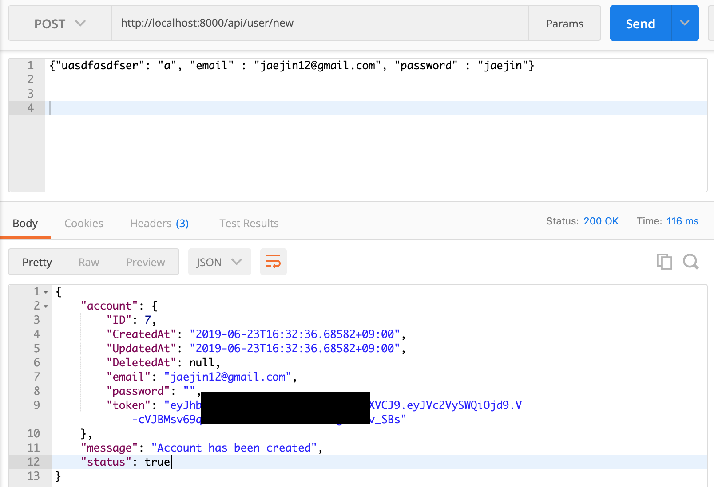
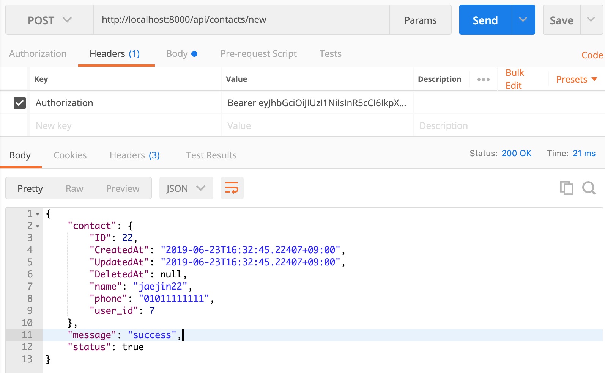
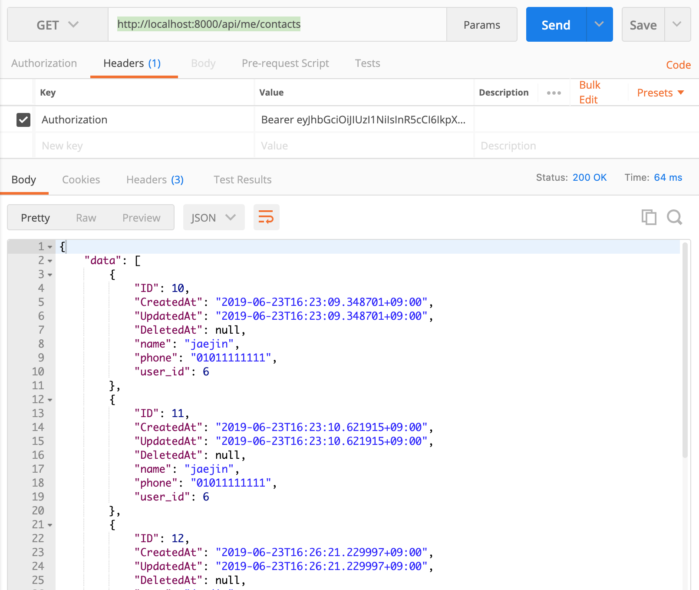
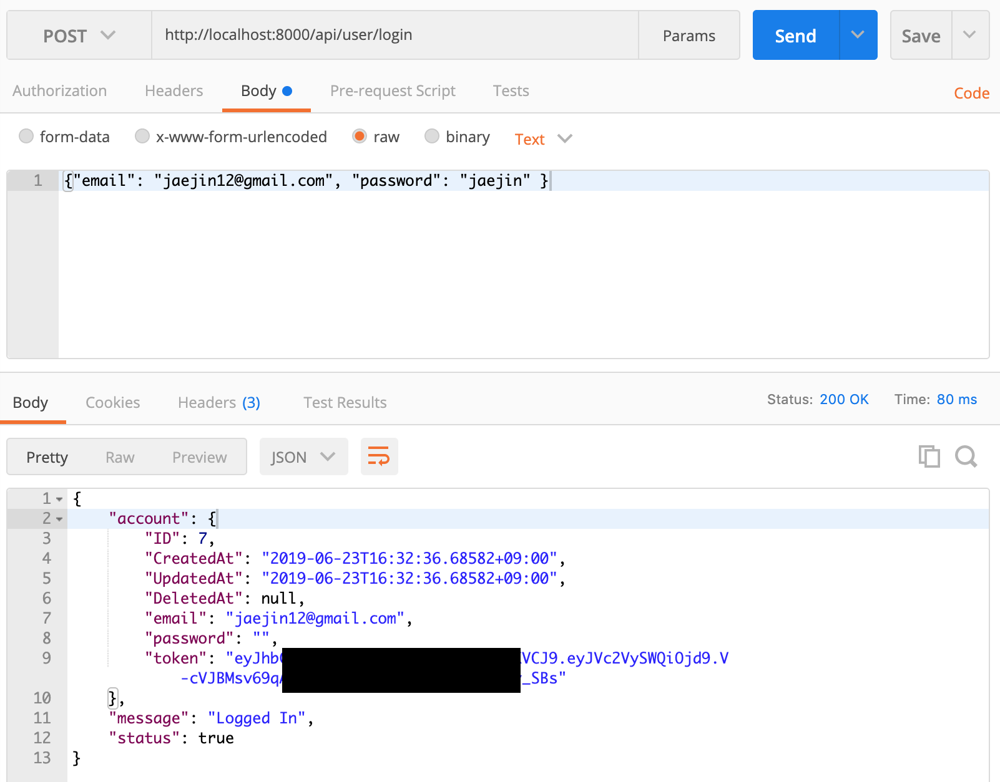

## RUN

go run main.go

## TEST

1. http://localhost:8000/api/user/new

2. http://localhost:8000/api/contacts/new

3. http://localhost:8000/api/me/contacts

4. http://localhost:8000/api/user/login

